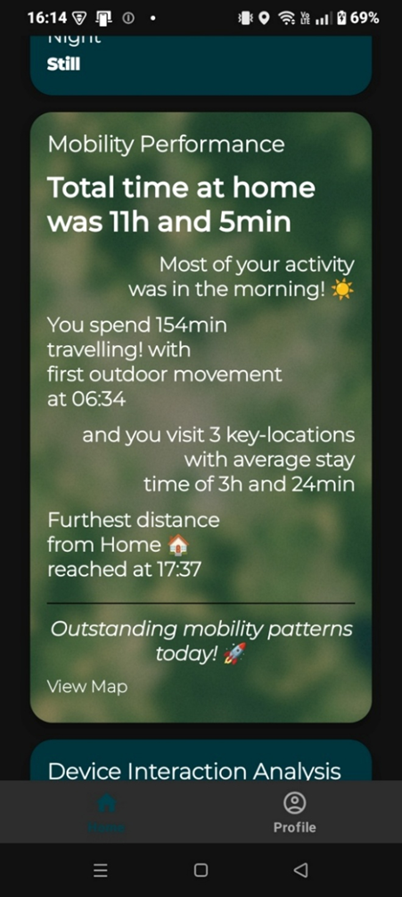

# Cognitive Monitoring System

A comprehensive cognitive monitoring platform that tracks and analyzes user cognitive states through keyboard interactions and behavioral data analysis. The system combines mobile sensing, custom keyboard logging, and statistical analysis to provide insights into user behavior patterns and cognitive performance.

## Overview

This repository contains three interconnected components that work together to collect, process, and visualize cognitive and behavioral data from mobile users:

- **LogMyself** - Android mobile application for comprehensive behavioral monitoring
- **LogBoard** - Custom Android keyboard for typing pattern analysis
- **ServerAnalysis** - Backend server for data processing and cognitive state analysis

The system enables real-time tracking of user interactions, typing patterns, and various behavioral metrics to understand cognitive states and performance over time.

## Architecture

The system follows a client-server architecture:

1. **Data Collection Layer**: Mobile apps (LogMyself & LogBoard) collect behavioral and typing data
2. **Data Transmission**: Secure data synchronization to cloud storage (Firebase/Firestore)
3. **Processing Layer**: ServerAnalysis performs scheduled analysis and generates insights
4. **Visualization Layer**: Mobile apps display insights and analytics to users

## Components

### LogMyself
An Android application built with Kotlin that monitors user behavior and provides personalized insights.

**Key Features:**
- Real-time behavioral monitoring
- Location and activity tracking
- Sensor data collection
- Personalized insights and analytics
- Cloud data synchronization

For detailed information, see [LogMyself README](LogMyself/README.md).

### LogBoard
A custom Android keyboard application written in Java that captures typing patterns and keyboard interaction data.

**Key Features:**
- Multi-language keyboard support
- Typing pattern analysis
- Keystroke dynamics logging
- Seamless integration with LogMyself
- Privacy-focused data collection

For detailed information, see the LogBoard component documentation.

### ServerAnalysis
A Python-based backend server using FastAPI and Celery for asynchronous data processing and analysis.

**Key Features:**
- Automated data processing pipelines
- Machine learning-based cognitive state analysis
- Scheduled task execution
- RESTful API endpoints
- Database management and synchronization

For detailed information, see [ServerAnalysis README](ServerAnalysis/README.md).

## Technology Stack

- **Mobile Apps**: Android (Kotlin, Java)
- **Backend**: Python (FastAPI, Celery)
- **Database**: Firebase/Firestore, Local SQL databases
- **Cloud Storage**: Firebase, Supabase
- **Containerization**: Docker

## Getting Started

Each component has its own setup instructions and requirements. Please refer to the individual README files in each directory:

1. [LogMyself Setup](LogMyself/README.md)
2. [ServerAnalysis Setup](ServerAnalysis/README.md)

## Use Cases

- **Cognitive Performance Monitoring**: Track mental state changes throughout the day
- **Behavioral Pattern Analysis**: Identify habits and behavioral trends
- **Research Applications**: Academic studies on human-computer interaction and cognitive science

## Privacy & Ethics

This system is designed with privacy considerations in mind. All data collection requires explicit user consent, and users maintain control over their data. The system is intended for personal use and research purposes with proper ethical oversight.

## Contributing

This is a research project. For questions or collaboration opportunities, please open an issue or contact the repository maintainer.
